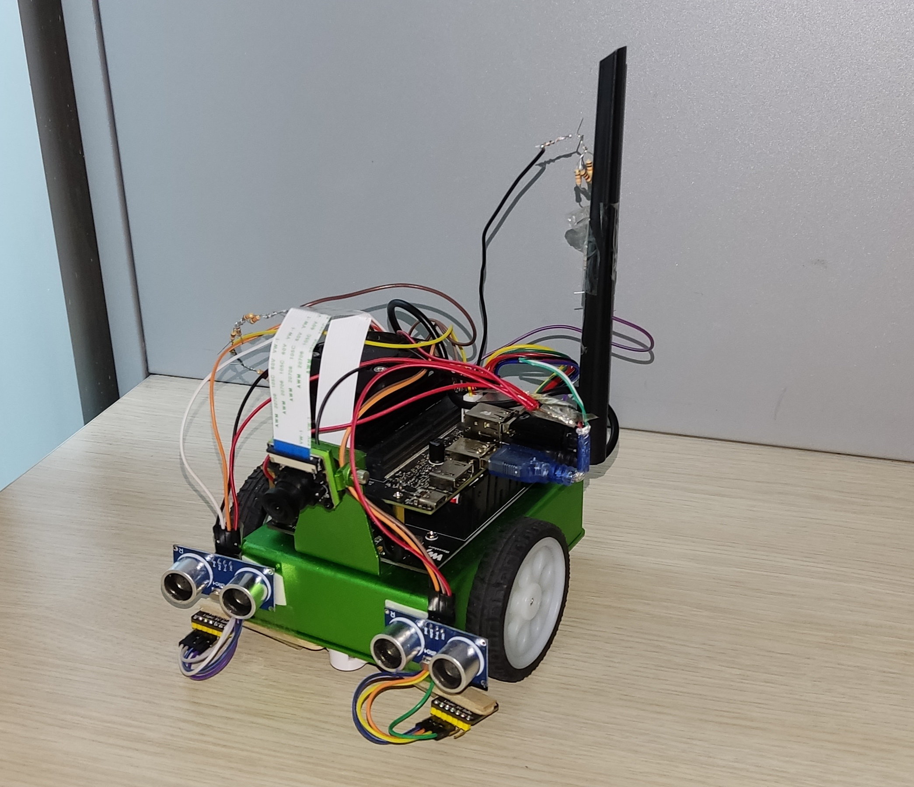
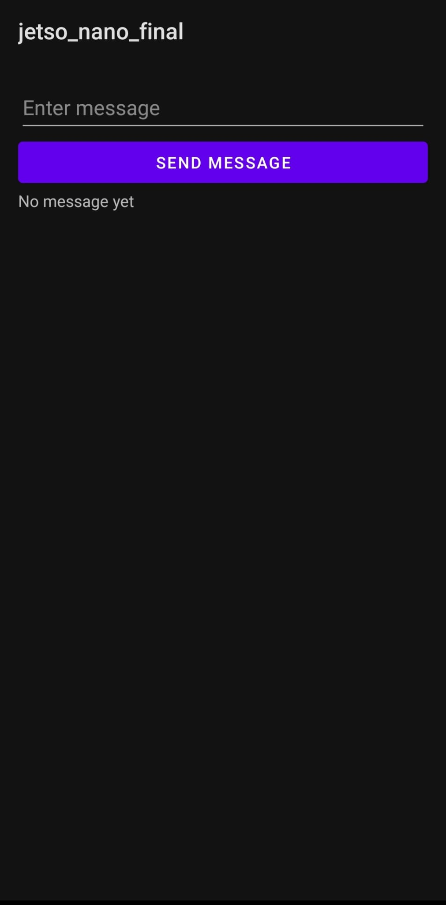

# TOBB ETÜ ELE495 - Capstone Project

# Table of Contents
- [Introduction](#introduction)
- [Features](#features)
- [Installation](#installation)
- [Usage](#usage)
- [Screenshots](#screenshots)
- [Acknowledgements](#acknowledgements)

## Introduction
This capstone project aims to develop an autonomous parking system using a JetBot, powered by NVIDIA Jetson Nano. The primary objective is to design and implement a solution that enables the JetBot to identify designated parking spots and park accurately without human intervention. This project addresses the problem of autonomous vehicle parking, which is a critical component in the development of smart cities and autonomous driving technologies.

## Features
- **Hardware:**
  - [NVIDIA Jetson Nano](https://www.nvidia.com/en-us/autonomous-machines/embedded-systems/jetson-nano/)
  - [JetBot](https://jetbot.org/master/index.html)
  - CSI Camera
  - Ultrasonic Sensors
  - Motor Driver
  - 2x TC3472 RGB Color sensor 

- **Operating System and Packages:**
  - Ubuntu 18.04
  - JetPack SDK
  - PyTorch
  - Torch2TRT
  - Flask

- **Applications:**
  - Real-time object detection
  - Collision avoidance
  - Road following

- **Services:**
  - Flask web server for communication
  - Deep learning models for navigation and obstacle detection

## Installation
To install and set up the project, follow these steps:

1. Clone the project repository:
  ```bash
   git clone https://github.com/ELE495-2324Summer/capstoneproject-gabya-grup-8.git
   cd capstoneproject-gabya-grup-8
   ```

2. Set up the environment:
   - Install necessary dependencies:
     ```bash
     sudo apt-get update
     sudo apt-get install -y python3-pip
     pip3 install -r requirements.txt
     ```
3. Download the models:
   - https://drive.google.com/drive/folders/1xTBfEoJHLqOazrkhEf3baGVgIXyZR199?usp=sharing

4. Connect the TCS3472 sensors to Arduino Nano and upload the rgb.txt code.


## Usage
To use the project, follow these instructions:

1. Start the JetBot and ensure it is connected to the network.
2. Run the Flask server to enable communication with the JetBot.
3. Use the web interface or API to send commands to the JetBot for navigation and parking.
4. Run the main code:
   ```bash
   python3 main.py
   ```

## Screenshots



For a video demonstration, visit [YouTube](https://youtu.be/example).

## Acknowledgements
Special thanks to the following contributors and resources:
- [dusty-nv/jetson-inference](https://github.com/dusty-nv/jetson-inference)
- [JetBot Documentation](https://jetbot.org/master/index.html)
- [NVIDIA](https://www.nvidia.com)
- [Flask Documentation](https://flask.palletsprojects.com/en/2.0.x/)

This project would not have been possible without the support and resources provided by these individuals and organizations.
